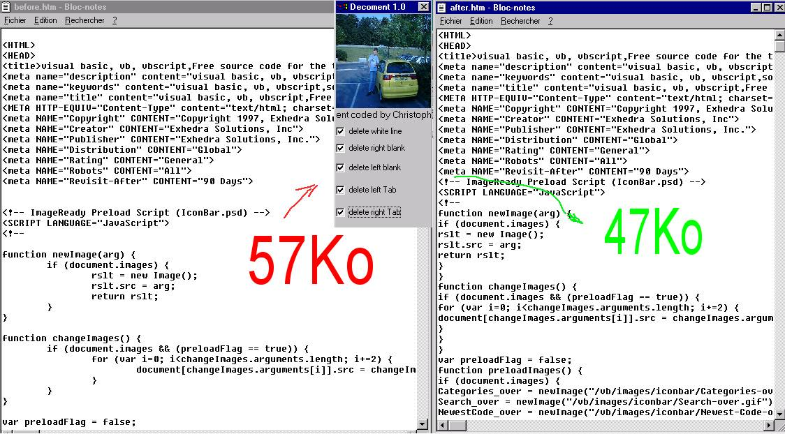



## HTML COMPRESSOR

### Description

before,sorry for my poor english...

drop a html file on the picture

decoment make a second html file that make exactelly the same that first. But "HTML COMPRESSOR" destroy all comments,white lines,left blanks...

very usefull if you want to upload your html files on your web-server if you have a slow connection.............PLEASE VOTE FOR ME.............
 
### More Info
 

             |
---                |---
**Submitted On**   |2000-03-16 19:22:26
**By**             |[COEYMAN Christophe](https://github.com/Planet-Source-Code/PSCIndex/blob/master/ByAuthor/coeyman-christophe.md)
**Level**          |Intermediate
**User Rating**    |4.0 (20 globes from 5 users)
**Compatibility**  |VB 5\.0, VB 6\.0
**Category**       |[Complete Applications](https://github.com/Planet-Source-Code/PSCIndex/blob/master/ByCategory/complete-applications__1-27.md)
**World**          |[Visual Basic](https://github.com/Planet-Source-Code/PSCIndex/blob/master/ByWorld/visual-basic.md)
**Archive File**   |[CODE\_UPLOAD1261412122000\.zip](https://github.com/Planet-Source-Code/coeyman-christophe-html-compressor__1-13536/archive/master.zip)

